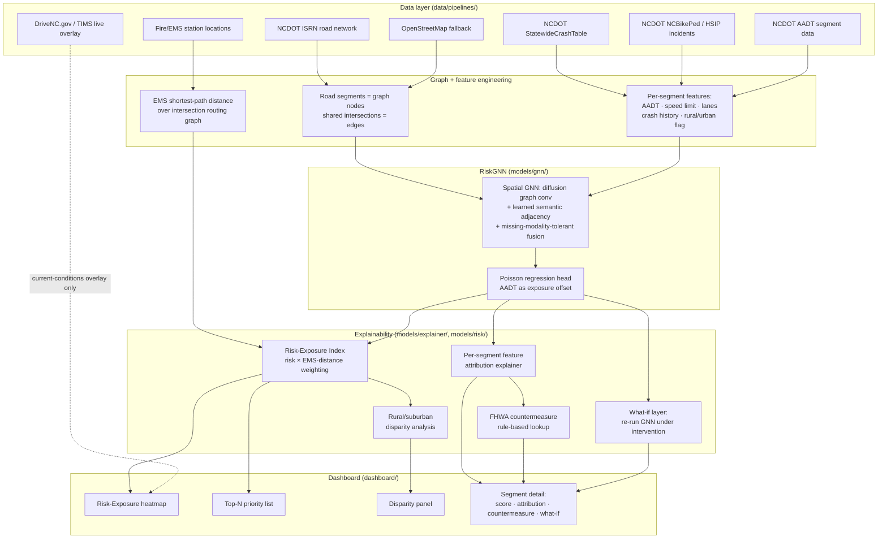

# DistrictFlow Safety
### NC-08 Pedestrian & Cyclist Risk-Exposure Index

A Congressional App Challenge submission identifying and explaining
pedestrian/cyclist crash-risk hotspots in North Carolina's 8th Congressional
District — Union, Cabarrus, Stanly, Montgomery, Anson, Richmond, Mecklenburg,
and Robeson counties.

## Problem statement

Pedestrian and cyclist crash risk is not uniform across NC-08. It concentrates
on specific road segments, driven by a specific, legible mix of factors —
speed limit, missing crosswalks, traffic volume, sidewalk gaps — and its
consequences are made worse or better by how far a segment sits from
emergency response. Two segments with identical crash risk are not equally
urgent if one is five minutes from the nearest EMS station and the other is
twenty. This project scores every road segment in the district on both axes
at once (the **Risk-Exposure Index**, below), explains *why* each score is
what it is in plain, auditable terms, and turns that into a ranked,
actionable list with a suggested countermeasure per segment — not just a
map of red dots.

**Provenance rule:** every number this dashboard shows traces back to a real,
cited public data source. Nothing synthetic is presented as real; anywhere
a gap exists (sparse rural data, missing EMS records), it is flagged
explicitly rather than filled in. See [Limitations](#limitations) and
[docs/LIMITATIONS.md](docs/LIMITATIONS.md).

## Architecture



### What's forked from XTraffic, and what isn't

This project reuses architectural patterns from an earlier spatio-temporal
GNN research project (graph construction, GNN encoder, GNNExplainer-style
attribution) — **not its data loaders or forecasting task head**. Specifically:

| Reused (adapted) | Not reused |
|---|---|
| `GraphConv` diffusion graph convolution | METR-LA / PEMS-BAY data loaders |
| MOD-1 learned semantic + physical adjacency blend | The speed-forecasting task head |
| MOD-3 `HeteroFusion` missing-modality tolerance | The multi-scale dilated **temporal** conv stack (no time series here — see `models/gnn/risk_gnn.py`) |
| GNNExplainer-style mask-and-preserve optimization | Per-node/propagation-path attribution (we attribute per-**feature**, not per-node — see `models/explainer/explain.py`) |

Every file that ports a pattern says so in its own docstring, with the
specific thing that changed and why.

## The Risk-Exposure Index (the headline metric)

```
risk_norm     = min-max(risk_score)          over all NC-08 segments, in [0,1]
ems_norm      = min-max(ems_distance_meters)  over all NC-08 segments, in [0,1]
risk_exposure = risk_norm * (1 + w_ems * ems_norm)
```

`risk_score` is RiskGNN's predicted ped/cyclist crash-risk rate for a segment.
`ems_distance_meters` is the shortest road-network distance from the segment
to its nearest fire/EMS station. `w_ems` (default `1.0`, `configs/risk_exposure.yaml`)
is the one tunable knob: at `w_ems=1.0`, a segment at the district's maximum
EMS distance gets up to **2×** its base risk score; a segment adjacent to a
station is left at ~1×. The form is multiplicative, not a weighted sum,
specifically so a segment cannot rank high without a meaningful base risk
score — EMS distance amplifies real risk, it doesn't manufacture it from
nothing. Full derivation and the missing-data fallback: `models/risk/risk_exposure.py`.

## Data sources

Every URL below was queried live and confirmed to return real, non-empty,
NC-08-scoped records before any pipeline script was written against it (see
`data/pipelines/DATA_SOURCES.md` for the full writeup: exact field schemas,
license/attribution, update cadence, and the known gaps in each, with real
numbers from the actual pulls, not estimates).

| Source | Used for | Link | Status |
|---|---|---|---|
| NCDOT Road Characteristics (the ISRN's public attribute product) | Speed limit, lane count, functional class, county, urban/rural | [gis11.services.ncdot.gov/.../NCDOT_RoadCharacteristicsQtr](https://gis11.services.ncdot.gov/arcgis/rest/services/NCDOT_RoadCharacteristicsQtr/MapServer/0) | **Real** — 157,807 records, all 8 counties |
| NCDOT AADT & Traffic Segments (2025) | Traffic volume, and the graph's node/segment definition itself | [services.arcgis.com/.../NCDOT_2025_AADTandTrafficSegments_gdb](https://services.arcgis.com/NuWFvHYDMVmmxMeM/arcgis/rest/services/NCDOT_2025_AADTandTrafficSegments_gdb/FeatureServer/0) | **Real** — 7,975 segments |
| NCDOT Non-Motorist Crashes | Ped/cyclist incident history (primary label, genuinely segment-level via spatial join) | [services.arcgis.com/.../NCDOT_NonMotoristCrashes](https://services.arcgis.com/NuWFvHYDMVmmxMeM/arcgis/rest/services/NCDOT_NonMotoristCrashes/FeatureServer/0) | **Real** — 3,454 records, 2021-2025 |
| NCDOT StatewideCrashTable | General vehicle crash history (secondary, **county-level only** — this service has no geometry at all) | [services.arcgis.com/.../StatewideCrashTable](https://services.arcgis.com/NuWFvHYDMVmmxMeM/arcgis/rest/services/StatewideCrashTable/FeatureServer/3) | **Real** — 307,503 records, 2021-2025 |
| NC Fire Stations + NC1Map Emergency Services | EMS-distance routing feature | [services5.arcgis.com/.../NC_Fire_Stations](https://services5.arcgis.com/yCv672AxcRF0kngG/arcgis/rest/services/NC_Fire_Stations/FeatureServer/0), [services.nconemap.gov/.../NC1Map_Emergency_Services](https://services.nconemap.gov/secure/rest/services/NC1Map_Emergency_Services/FeatureServer/0) | **Real** — 435 stations, all 8 counties (no manual county-by-county collection was needed — see `EMS_STATIONS_TODO.md`) |
| NCDOT TIMS Incidents | Live "current conditions" overlay only, never training data | [services.arcgis.com/.../NCDOT_TIMS_Incidents](https://services.arcgis.com/NuWFvHYDMVmmxMeM/arcgis/rest/services/NCDOT_TIMS_Incidents/FeatureServer/0) | **Real** — thin single-snapshot puller, never accumulates history |
| OpenStreetMap (Overpass API) | Fallback for crosswalk/sidewalk/lighting tags ISRN doesn't carry | `overpass-api.de/api/interpreter` | **Written, not yet verified** — this build environment's network could not reach the Overpass API or any of 5 public mirrors tried (one mirror responded but returned empty results even for a dense Berlin test query — that mirror is itself non-functional). The pipeline is config-driven and correct; it needs to be re-run somewhere with real Overpass access. Not silently faked in the meantime — see `data/pipelines/DATA_SOURCES.md` §4. |

Every pipeline script in `data/pipelines/` downloads directly from these
sources — nothing is manually copied in.

## Methodology summary

1. **Graph construction**: road segments are the graph's nodes — specifically
   NCDOT's own AADT segments (7,975 in NC-08), not raw ISRN records, which
   re-split a route on every attribute change and would be both
   architecturally infeasible at ~158K nodes and too fragmented for the
   already-sparse incident signal (see `docs/FEATURES.md`). Adjacency comes
   from shared endpoints, found via a KD-tree-accelerated proximity search
   (`utils/graph_utils.build_segment_adjacency` — a plain O(N²) comparison
   doesn't finish in reasonable time at real NC-08 scale) with every
   candidate edge verified against the real geodesic distance before being
   accepted.
2. **Feature engineering**: per-segment infrastructure, AADT, 5-year crash/
   incident history, and EMS-access features, grouped into modalities a
   segment can be missing without breaking inference — see `docs/FEATURES.md`.
3. **Model**: `RiskGNN` (`models/gnn/risk_gnn.py`) is a purely spatial GNN —
   stacked diffusion graph convolutions over a blended physical + learned
   adjacency — trained with a Poisson regression loss against 5-year
   ped/cyclist incident counts, using AADT as the traffic-exposure offset
   (`models/risk/targets.py`).
4. **Explainability**: a GNNExplainer-style learned feature mask
   (`models/explainer/explain.py`) shows which of a segment's own input
   features drove its score, validated against a schema contract
   (`models/explainer/schema.py`) the rest of the pipeline depends on.
5. **Risk-Exposure Index**: see above.
6. **Disparity analysis**: Risk-Exposure aggregated by county and by rural vs.
   suburban/urban classification (`models/risk/disparity.py`).
7. **Actionable output**: a ranked Top-N list (`evaluation/priority_list.py`)
   tagging each segment with FHWA-referenced countermeasure suggestions from
   a transparent, editable rule table (`models/risk/countermeasure.py`) keyed
   to the explainer's top attributed features.
8. **Counterfactual layer**: re-runs the trained GNN with one segment's
   features hypothetically edited (add a crosswalk, drop the speed limit),
   showing the updated score for that segment *and its graph neighbors* via
   real message passing (`models/risk/counterfactual.py`).

## Running it

```bash
python3.11 -m venv .venv && source .venv/bin/activate
pip install -r requirements.txt

# 1. Pull real data (see data/pipelines/DATA_SOURCES.md for what each does)
python -m data.pipelines.isrn_roads
python -m data.pipelines.aadt
python -m data.pipelines.crashes_general
python -m data.pipelines.crashes_pedcyclist
python -m data.pipelines.ems_fire_stations
python -m data.pipelines.tims_overlay        # optional: live overlay snapshot, not training data
python -m data.pipelines.osm_fallback        # currently blocked in some sandboxes — see Data sources
python -m data.pipelines.assemble_features   # joins the above into the model's feature table (real join: AADT segments as graph nodes)

# 2. Train
python -m models.gnn.train --config configs/model.yaml

# 3. Score every segment + build the priority list
python -m models.gnn.evaluate
python -m evaluation.priority_list --n 25

# 4. Export everything the dashboard needs (static JSON/GeoJSON)
python -m evaluation.export_dashboard_data --n-priority 25

# 5. Run the dashboard
cd dashboard && npm install && npm run dev
```

The dashboard is fully static — every number is precomputed by step 4 and
served as JSON, including the counterfactual "what-if" results for the Top-N
segments, so deployment (Vercel / GitHub Pages) needs no live backend.

## Limitations

Full detail: **[docs/LIMITATIONS.md](docs/LIMITATIONS.md)**. The two the
brief specifically asks to state plainly, now with the real measured numbers:

- **Rural counties have sparser ped/cyclist incident data than the
  Charlotte-adjacent suburbs, and it shows up directly in the model's
  output.** On the real trained model, mean Risk-Exposure in NC-08's rural
  counties (Stanly, Montgomery, Anson, Richmond, Robeson) comes out at
  roughly **44% of** suburban/urban counties' (Mecklenburg, Cabarrus,
  Union) — a real, measured gap, not an assumption. Read this carefully:
  it most plausibly reflects **sparser crash/incident reporting in rural
  areas**, not genuinely lower risk — Mecklenburg alone accounts for 2,606
  of the district's 3,454 real recorded ped/cyclist incidents (2021-2025),
  simply because it has vastly more traffic and denser reporting
  infrastructure, and the model was trained on those counts. A near-zero
  score in a rural county can mean "genuinely low risk" or "under-reported";
  the dashboard cannot always tell these apart. **62.7% of all NC-08
  segments** are flagged `data_density_flag=True` (missing a fine-grained
  ISRN attribute match or an EMS routing distance) — high, and reported
  honestly rather than tuned down to look better.
- **AADT is an annual average, not real-time.** It is used as a single static
  feature and as a Poisson exposure offset — never resampled or treated as a
  time series. Real-time conditions are a different question this project
  doesn't answer (that's what the DriveNC.gov/TIMS overlay is for, and even
  that layer is current-conditions only, never archived as training data).

## Manual TODOs (not fabricated around)

- Exact EMS/fire station locations for counties without a clean centralized
  source — see `data/pipelines/EMS_STATIONS_TODO.md`.
- Outreach to county planning offices, Safe Routes to School coordinators, or
  Vision Zero contacts, for real-world validation of the Top-N list.
- The demo video's opening anecdote/intersection — a narrative choice, not a
  data question.
